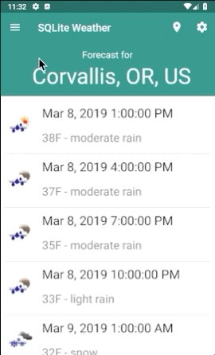

# Assignment 4
**Due by 11:59pm on Monday, 3/9/2020**

**Demo due by 11:59pm on Friday, 3/20/2020**

In this assignment, we'll incorporate an SQLite database into our weather app to save the locations for which the user views forecasts.  There are a few different tasks associated with this assignment, described below.  This repository provides you with some starter code that implements the weather app from Assignment 3.

**NOTE: make sure to add your own API key in [`OpenWeatherMapUtils.java`](app/src/main/java/com/example/android/sqliteweather/utils/OpenWeatherMapUtils.java#L32) to make the app work.**

## 1. Add a navigation drawer to your app

First, add a navigation drawer to your app.  The navigation drawer should be accessible via a "hamburger" icon in the navigation bar in the app's main activity.  For now, you can simply add some dummy content into the drawer so you can see it in open and close.

## 2. Incorporate an SQLite database to save forecast locations

Next, use the Room persistence library to incorporate into your app an SQLite database in which you'll save the locations (i.e. cities) for which the user requests a weather forecast.  The data you store in this database can be quite simple.  All you'll really need to store is the name of the location/city.  To make this work with the Room persistence library, you'll need to define an Entity, a Data Access Object (DAO), and a Database class.

## 3. Save the locations for which the user requests a forecast

Now, modify your app so that whenever the user changes the forecast location in the preferences, the new location is saved into the database you just created.  A given location should be stored at most once in the database.  In other words, your database should not contain duplicate locations.  To save locations into the database, you'll have to implement an `OnSharedPreferenceChangedListener` that detects when the location preference has changed and saves a location into the database if it's not already there.

## 4. List the saved locations in the navigation drawer using a `RecyclerView`

Next, add a `RecyclerView` to your navigation drawer that lists the locations saved in the database.  Make sure to implement an `Adapter` class to manage the underlying location data.  The layout associated with a single item in your `RecyclerView` list can be very simple, containing only the location name.

**Importantly, the `RecyclerView` you implement here will take the place of the `NavigationView` we used in the code we implemented in lecture.**  In other words, you won't use a `NavigationView` in this assignment.

## 5. Update the forecast location when the user clicks on a location in the navigation drawer

Finally, hook up a click listener on the items in your navigation drawer `RecyclerView` so that when the user clicks on a specific location in the navigation drawer, the drawer closes, and the displayed forecast is updated to show the forecast for the clicked location.

The easiest way to get this click listener to work is probably to do something similar to what we did when we implemented a click listener on the items in the forecast `RecyclerView` list to launch a new activity to view detailed information about the clicked forecast.  Specifically, to make that work, we implemented an `interface` that we used to invoke a method in the main activity class from the `ViewHolder` associated with the clicked item in the forecast list.  That method in the main activity handled creating an `Intent` and launching the detail view activity.

In this case, the method in the main activity simply has to update the location for which the forecast is displayed.  Since the starter code with which you're provided is already hooked up to update the displayed forecast (and also to update the location displayed across the UI) whenever the location is changed in the preferences, the most straightforward way to display the forecast for the clicked location would probably be to use a [`SharedPreferences.Editor`](https://developer.android.com/reference/android/content/SharedPreferences.html#edit()) to modify the location stored in the shared preferences (making sure to [apply](https://developer.android.com/reference/android/content/SharedPreferences.Editor.html#apply()) the changes).  This approach has the added benefit that the app will always display the forecast for the last-selected location whenever the user quits and restarts the app.  In fact, it's quite common in practice to utilize programmatically set `SharedPreferences` values in this way.

You can see the expected behavior of the main activity with all of the assignment's required functionality here:

## Extra credit

The flow we implemented above works alright to allow the user to add cities to the database and select them to view their weather forecasts, but the user's experience of having to enter a city in the app's preferences in order to be able to select that city in the navigation drawer is a poor one.

For up to 10 points worth of extra credit, you can implement a better user experience by adding an element (e.g. a clickable entry with a "+" sign) at the top of the navigation drawer on which the user can click to add a new location to the database.  When the user clicks this element, your app should open a dialog that prompts the user to enter a new forecast location.  If the user clicks an "accept" button in the dialog, the location they entered should be added into to the database and thus displayed in the navigation drawer.

For more on dialogs in Android, see this page:

https://developer.android.com/guide/topics/ui/dialogs

If you choose to implement the extra credit, you may get rid of the location preference from the preferences screen.  Note that it may still be useful to use the location preference and its key as a mechanism for triggering a new forecast to be fetched and for storing the location for which the forecast was last requested.

## Submission

As usual, we'll be using GitHub Classroom for this assignment, and you will submit your assignment via GitHub. Make sure your completed files are committed and pushed by the assignment's deadline to the master branch of the GitHub repo that was created for you by GitHub Classroom. A good way to check whether your files are safely submitted is to look at the master branch your assignment repo on the github.com website (i.e. https://github.com/osu-cs492-w20/assignment-4-YourGitHubUsername/). If your changes show up there, you can consider your files submitted.

## Grading criteria

This assignment is worth 100 points, broken down as follows:

  * 25 points: app includes a navigation drawer
  * 10 points: Room persistence components (Entity, DAO, and Database) are appropriately defined
  * 20 points: locations are added into the database when the user enters them in the preferences screen (if they don't already exist in the database)
  * 25 points: navigation drawer displays the locations stored in the database using a `RecyclerView`
  * 20 points: clicking a location in the navigation drawer displays the forecast for the selected location

You may also earn up to 10 points worth of extra credit as described above.
